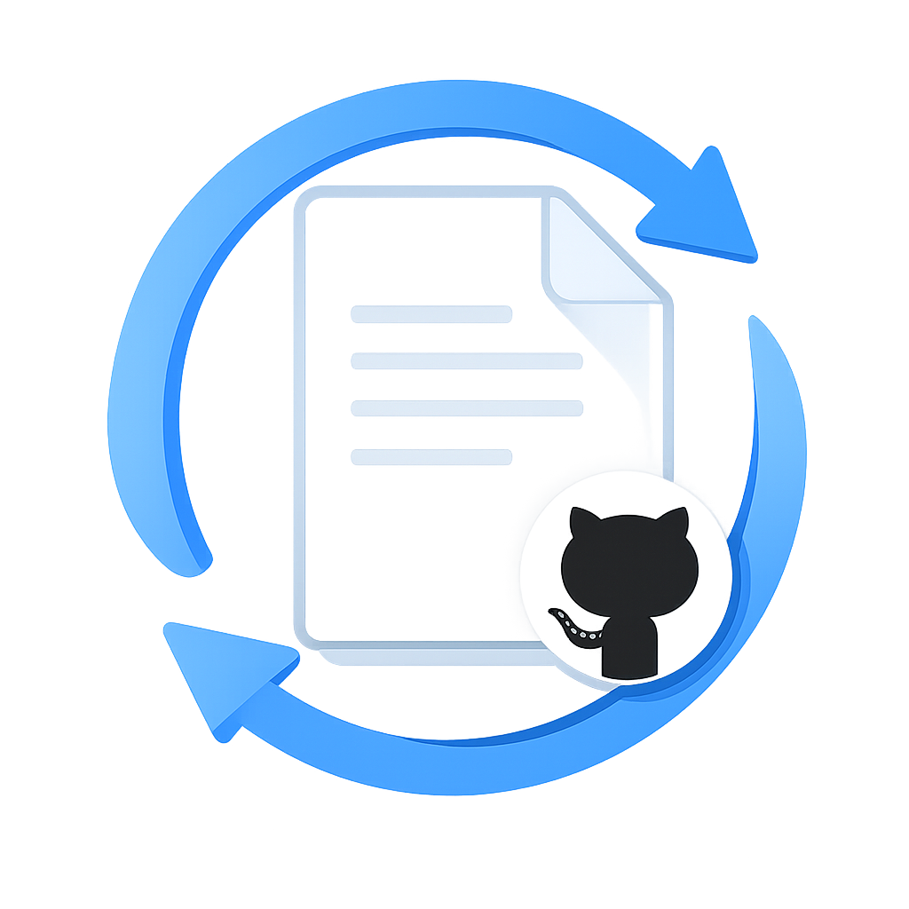

# GitHub Copilot Gist Sync

<div align="center">
  
  <p><strong>Keep your GitHub Copilot instructions in sync across all your projects!</strong></p>
</div>

---

## 🎯 What is this?

**GitHub Copilot Gist Sync** is a Visual Studio extension that automatically syncs `copilot-instructions.md` from a GitHub Gist (public or secret) into your repository's `.github` folder.

No more copying and pasting instructions between projects. Create one Gist, configure once, and all your repositories stay in sync!

---

## 🤔 Why Was This Built?

**The Problem**: GitHub Copilot currently doesn't support global instruction files or shared instruction files across teams. If you work with multiple repositories, you need to manually copy and maintain `copilot-instructions.md` in each project's `.github` folder. This becomes cumbersome and error-prone, especially when:

- 📂 You have dozens of repositories to manage
- 👥 Your team wants to share common coding standards
- 🔄 You need to update instructions across all projects simultaneously
- ⏱️ You're wasting time copying files between projects

**The Solution**: This extension enables you to:

- 📝 **Define once, use everywhere** - Maintain a single source of truth in a GitHub Gist
- 👥 **Share with your team** - Use secret gists to share team-wide instructions privately
- 🔄 **Stay synchronized** - Automatically sync instructions across all your repositories
- ⚡ **Save time** - No more manual copying and pasting
- 🔒 **Privacy control** - Support for both public and secret gists

---

## ✨ Features

- ✅ **Public & Secret Gist Support** - Works with both public and secret gists
- ✅ **One-way Sync** - Your Gist is never modified (Gist → Repository only)
- ✅ **Auto-sync on Solution Open** - Optional automatic synchronization
- ✅ **Manual Sync Command** - Sync on demand with a single click
- ✅ **Smart Updates** - Only updates files when content actually changes
- ✅ **Status Bar Integration** - Visual progress indicator
- ✅ **Non-intrusive** - No popup interruptions during auto-sync
- ✅ **Team Sharing** - Use secret gists to share instructions with your team

---

## 📦 Installation

### From VSIX File

1. Download the latest `.vsix` file from the [Releases](https://github.com/rogierv/Copilot-Instructions-from-Gist/releases) page
2. Double-click the `.vsix` file to install
3. Restart Visual Studio
4. The extension is now installed!

### From Source

1. Clone this repository
2. Open the solution in Visual Studio 2022
3. Build the project in **Release** mode
4. Locate the generated `.vsix` file in `bin\Release\`
5. Double-click the `.vsix` file to install
6. Restart Visual Studio

---

## ⚙️ Configuration

### Step 1: Create a GitHub Gist

1. Go to [gist.github.com](https://gist.github.com)
2. Create a new Gist (can be **public** or **secret**)
   - **Public**: Anyone can see it (no authentication needed)
   - **Secret**: Only people with the link can access it (great for team sharing)
3. Name the file exactly: `copilot-instructions.md`
4. Add your Copilot instructions (see examples below)
5. Click "Create secret gist" or "Create public gist"
6. Copy the Gist URL (e.g., `https://gist.github.com/username/1234567890abcdef`)

> **💡 Tip**: You can use either the Gist URL or the raw URL format: `https://gist.githubusercontent.com/username/1234567890abcdef/raw/copilot-instructions.md`

> **👥 Team Tip**: Use a secret gist to share team-specific coding standards without making them publicly visible!

### Step 2: Configure the Extension

1. Open Visual Studio 2022
2. Navigate to: **Tools** → **Options** → **GitHub Copilot Gist Sync**
3. Enter your **Gist URL** in the configuration field
4. (Optional) Enable **Auto Sync on Solution Open**
5. Click **OK** to save


---

## 🚀 Usage

### Manual Synchronization

Sync your Copilot instructions at any time:

1. In Visual Studio, go to: **Tools** → **Sync Copilot Instructions**
2. The extension will download and update `.github/copilot-instructions.md`
3. Check the Visual Studio status bar for progress


### Automatic Synchronization

When **Auto Sync on Solution Open** is enabled:

- ✅ Sync runs automatically when you open a solution
- ✅ Progress is shown in the Visual Studio status bar
- ✅ No popup dialogs interrupt your workflow
- ✅ Sync is skipped if:
  - Auto Sync is disabled
  - No Gist URL is configured
  - The file is already up to date

---

## 📋 How It Works

1. You maintain a single `copilot-instructions.md` file in a GitHub Gist (public or secret)
2. The extension downloads the file from your Gist
3. It writes/updates `.github/copilot-instructions.md` in your repository
4. GitHub Copilot uses the file for context-aware suggestions

**Important**: 
- The extension **only reads** from your Gist (never writes)
- The `.github` folder will be created if it doesn't exist
- Files are only updated when content actually changes (no unnecessary Git diffs)

### Flow Diagram

```
┌─────────────────────┐
│  GitHub Gist        │
│  (Public or Secret) │
└────────┬────────────┘
         │
         │ Download
         ▼
┌─────────────────┐
│   Extension     │
│   Downloads     │
└────────┬────────┘
         │
         │ Write/Update
         ▼
┌─────────────────────────────────┐
│  .github/copilot-instructions.md │
│  (Your Repository)               │
└──────────┬──────────────────────┘
           │
           │ Used by
           ▼
┌─────────────────┐
│ GitHub Copilot  │
│ (AI Assistant)  │
└─────────────────┘
```

---

## 🛠️ Requirements

- **Visual Studio 2022** (version 17.0 or later)
- A **GitHub Gist** (public or secret) containing a file named `copilot-instructions.md`

---

## 📝 Example Gist Structure

Your Gist (public or secret) should contain a file named exactly `copilot-instructions.md`:

**Example content**:

```markdown
# Coding Standards

- Use C# 12 features where appropriate
- Follow Microsoft naming conventions
- Write XML documentation for public APIs
- Prefer async/await for I/O operations
- Use primary constructors where applicable

# Project Conventions

- Use file-scoped namespaces
- Enable nullable reference types
- Target .NET 8.0 for new projects
- Use collection expressions for initializations

# Architecture Patterns

- Follow SOLID principles
- Use dependency injection
- Implement repository pattern for data access
- Prefer immutable types where possible

# Testing Standards

- Write unit tests for all public APIs
- Use xUnit as the testing framework
- Aim for >80% code coverage
- Use descriptive test method names

# Security Guidelines

- Never hardcode secrets or connection strings
- Use User Secrets for local development
- Use Azure Key Vault for production secrets
- Validate all user inputs
```

---

## 🎨 What Gets Created

After synchronization, your repository will have:

```
your-repository/
├── .github/
│   └── copilot-instructions.md  ← Created/updated by this extension
├── src/
├── ...
```

GitHub Copilot automatically reads `.github/copilot-instructions.md` to provide better, context-aware suggestions!

---

## 💡 Use Cases

### Personal Developers
- ✅ Maintain consistent coding standards across all your personal projects
- ✅ Define your preferred patterns and practices once
- ✅ Automatically apply them to every repository you work on
- ✅ Keep your coding style consistent

### Teams & Organizations
- ✅ Share team-wide coding standards using a secret gist
- ✅ Ensure all team members have the same Copilot instructions
- ✅ Update instructions once, sync to all team repositories
- ✅ Onboard new developers with standardized AI assistance
- ✅ Enforce architectural patterns across projects
- ✅ Maintain compliance with company coding guidelines

### Example Team Workflow
1. Team lead creates a secret gist with team coding standards
2. Team lead shares the gist URL with the team (via internal docs/wiki)
3. Each team member configures the extension with the same gist URL
4. Everyone gets the same Copilot instructions across all team repositories
5. When standards are updated in the gist, everyone's projects sync automatically

---

## 🔍 Troubleshooting

### "No Gist URL configured" message

**Solution**: Configure the Gist URL in **Tools → Options → GitHub Copilot Gist Sync**

### Sync doesn't happen automatically

**Solutions**: 
1. Check that **Auto Sync on Solution Open** is enabled in options
2. Verify your Gist URL is correct
3. Ensure the Gist URL is accessible (public or you have the secret link)
4. Restart Visual Studio after changing options

### File isn't updating

**Solutions**:
1. Verify your Gist contains a file named exactly `copilot-instructions.md`
2. Check that the Gist URL is accessible in a browser
3. Try running **Tools → Sync Copilot Instructions** manually
4. Check the Visual Studio Output window for error messages

### "Failed to download Gist" error

**Solutions**:
1. Verify the Gist URL is correct (copy it from your browser)
2. Make sure you have access to the Gist:
   - Public gists work for everyone
   - Secret gists require the exact URL (including the ID)
3. Check your internet connection
4. Try accessing the Gist URL directly in a browser to verify it works
5. If using a corporate network, check if GitHub is accessible

### Copilot isn't using the instructions

**Solutions**:
1. Ensure the file is created at `.github/copilot-instructions.md`
2. Restart GitHub Copilot in Visual Studio
3. Check that GitHub Copilot is properly configured and authenticated
4. Verify the content in the file is valid markdown

---

## 🎯 Design Principles

This extension is built with the following principles in mind:

- **Source of truth lives in GitHub** - Your Gist is the single source of truth
- **Repository remains clean** - No unnecessary file modifications
- **No unnecessary Git diffs** - Files are only updated when content changes
- **No blocking UI** - All operations run asynchronously
- **Minimal user interruption** - Auto-sync runs silently in the background
- **Privacy first** - Support for secret gists ensures team privacy

---

## 🤝 Contributing

Contributions are welcome! Please feel free to submit a Pull Request.

1. Fork the repository
2. Create your feature branch (`git checkout -b feature/AmazingFeature`)
3. Commit your changes (`git commit -m 'Add some AmazingFeature'`)
4. Push to the branch (`git push origin feature/AmazingFeature`)
5. Open a Pull Request

---

## 📄 License

This project is licensed under the MIT License - see the [LICENSE](LICENSE) file for details.

---

## 👤 Author

**Rogier Verkaik**

- GitHub: [@rogierv](https://github.com/rogierv)

---

## 🙏 Acknowledgments

- Thanks to the Visual Studio Extensibility team for their excellent documentation
- Inspired by the need to maintain consistency across multiple repositories
- Built to solve a real problem that many developers face daily

---

## 📸 Screenshots

> **Note**: Screenshots marked as missing need to be created. See the instructions below for each screenshot.

### Configuration Dialog
**Status**: ⏳ *Screenshot needed*

To create this screenshot:
1. Open Visual Studio 2022
2. Go to **Tools** → **Options**
3. Navigate to **GitHub Copilot Gist Sync** in the left panel
4. Take a screenshot showing the configuration options
5. Save as `docs/screenshots/options-config.png`

### Manual Sync Command
**Status**: ⏳ *Screenshot needed*

To create this screenshot:
1. Open Visual Studio 2022
2. Click on the **Tools** menu
3. Hover over **Sync Copilot Instructions**
4. Take a screenshot of the expanded menu
5. Save as `docs/screenshots/manual-sync.png`

---

**Made with ❤️ to make developers' lives easier**
